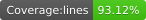

# 📱 React Native Auth & Navigation Assessment

  
<!-- 👆 This badge will auto-update if you generate it with `jest-coverage-badges` -->

This project is a **React Native authentication flow** with **React Navigation**, **React Context API**, and a simple **bottom tab navigator** after login.  
It demonstrates clean architecture, context-based state management, and unit testing with **Jest** + **React Native Testing Library**.

---
📸 Demo & 🎥 Video Walkthrough


## 🛠️ Installation & Setup

1️⃣ Clone the repo
```bash
git clone https://github.com/Rukmoni/AuthContext.git
cd AuthContext
```

2️⃣ Install dependencies
```bash
yarn install
# or
npm install
```

3️⃣ Start Metro & Run the App
```bash
yarn start
yarn ios      # for iOS simulator
yarn android  # for Android emulator
```
🧪 Running Tests & Generating Coverage Badge

```bash
yarn test --coverage
```

## 🚀 Features

✅ **Authentication Context**
- Login, Signup, Logout  
- Persist user session with `@react-native-async-storage/async-storage`  
- Error handling & state restoration  

✅ **Navigation**
- **AuthStack**: Login & Signup screens  
- **AppTabs**: Home, Profile, Settings screens with bottom tab navigation  
- Auto-redirect based on user state  

✅ **UI/UX**
- Form validation (basic required fields)  
- Show/Hide password toggle  
- Clean, minimal design using `lightTheme`  
- Keyboard-safe inputs with `KeyboardAvoidingView`  

✅ **Testing**
- Unit tests for:
  - `AuthContext` (login, signup, logout, restore user)
  - `AppNavigator` (renders correct stack based on user state)
  - `LoginScreen` & `SignupScreen` (form validation, button clicks)
- Configured **Jest + Testing Library** with 90%+ coverage  

---

## 📂 Project Structure

```bash
src
├── components
│   └── LoginFooter.tsx
├── context
│   ├── AuthContext.tsx
│   └── __tests__/AuthContext.test.tsx
├── navigation
│   ├── AppNavigator.tsx
│   ├── AuthStack.tsx
│   └── AppTabs.tsx
├── screens
│   ├── LoginScreen.tsx
│   ├── SignupScreen.tsx
│   ├── HomeScreen.tsx
│   ├── ProfileScreen.tsx
│   └── SettingsScreen.tsx
│   └── __tests__/
│       ├── LoginScreen.test.tsx
│       └── SignupScreen.test.tsx
├── services
│   └── storage.ts
└── theme
    └── index.ts
